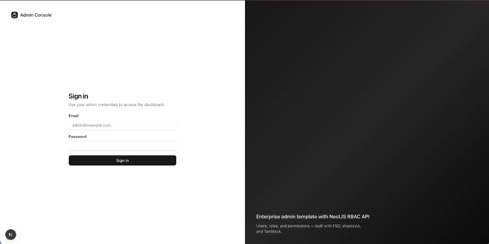
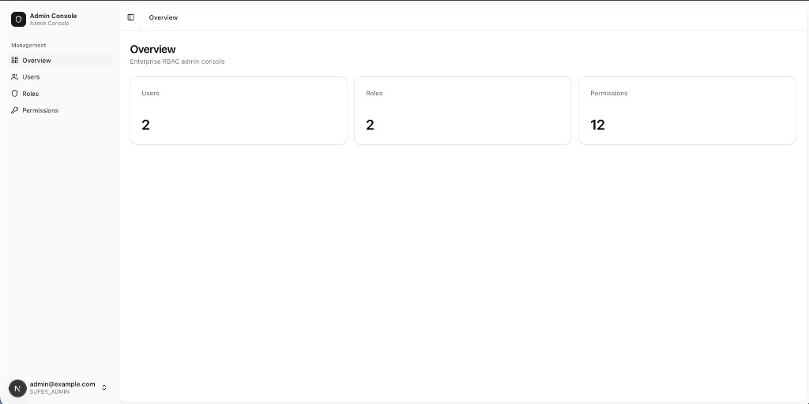
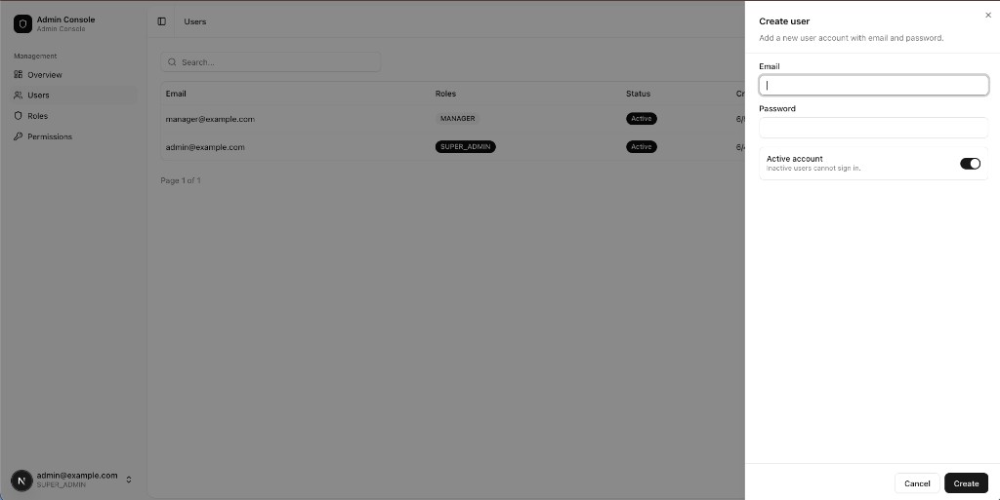
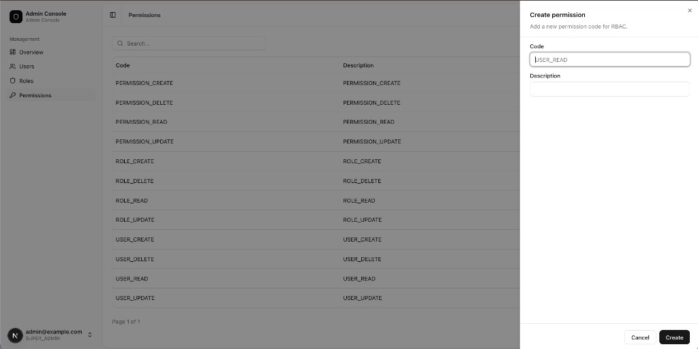

# Next.js Admin RBAC Template

[](https://github.com/devTugu/nextjs-fsd-template/actions/workflows/ci.yml)
[](LICENSE)
[](https://nextjs.org/)
[](https://www.typescriptlang.org/)

Production-ready **Next.js 16** admin dashboard with **Feature-Sliced Design (FSD)**, wired to the companion [NestJS FSD Template](https://github.com/devTugu/nestjs-fsd-template) RBAC API.

---

## Architecture

```
src/
├── app/                 # Next.js App Router pages (thin route shells)
├── widgets/             # Composite UI blocks (sidebar, data-table, sheets)
├── features/            # User-facing capabilities (auth, users, roles, permissions)
├── entities/            # Domain models, API hooks, table columns
├── shared/              # API client, UI kit, config, hooks, utils
└── processes/           # Cross-cutting app flows (routes, middleware helpers)
```

**Import rule (strict):**

```
app → widgets, features, entities, shared, processes
widgets → features, entities, shared
features → entities, shared
entities → shared only
```

See [docs/ARCHITECTURE.md](docs/ARCHITECTURE.md), [docs/adr/001-feature-sliced-design.md](docs/adr/001-feature-sliced-design.md), [docs/adr/002-api-client-and-auth.md](docs/adr/002-api-client-and-auth.md), and [docs/adr/003-admin-sheet-ux.md](docs/adr/003-admin-sheet-ux.md).

Additional guides: [Production](docs/PRODUCTION.md) · [Security](docs/SECURITY.md) · [Contributing](docs/CONTRIBUTING.md)

---

## Gallery

| Sign in | Dashboard overview | Create user (sheet) |
|---|---|---|
|  |  |  |

| Create role (permission picker) | Create permission (sheet) |
|---|---|
|  |  |

---

## Tech stack

| Category | Technology |
|----------|------------|
| Framework | Next.js 16 (App Router) |
| Architecture | Feature-Sliced Design |
| Data fetching | TanStack Query v5 |
| Tables | TanStack Table v8 |
| Forms | react-hook-form + Zod |
| UI | shadcn/ui + Tailwind CSS 4 |
| Motion | Framer Motion |
| HTTP | Axios (Nest envelope + JWT refresh) |
| E2E | Playwright |

---

## Prerequisites

- Node.js 18+
- Running [nestjs-fsd-template](https://github.com/devTugu/nestjs-fsd-template) API (MySQL + optional Redis)

---

## Local setup

### 1. Backend (port 3001)

```bash
git clone https://github.com/devTugu/nestjs-fsd-template.git
cd nestjs-fsd-template
cp .env.example .env
# Set DB_*, JWT_* (32+ chars), CORS_ORIGIN=http://localhost:3000, APP_PORT=3001
npm install
npm run migration:run
npm run seed
APP_PORT=3001 npm run start:dev
```

- API: `http://localhost:3001/api/v1`
- Swagger: `http://localhost:3001/docs` (when `SWAGGER_ENABLED=true`)

### 2. Frontend (port 3000)

```bash
git clone https://github.com/devTugu/nextjs-fsd-template.git
cd nextjs-fsd-template
cp .env.example .env.local
npm install
npm run dev
```

Open [http://localhost:3000](http://localhost:3000)

**Seed admin:** `admin@example.com` / `Admin123!`

---

## Environment

| Variable | Example | Required |
|----------|---------|----------|
| `NEXT_PUBLIC_API_BASE_URL` | `http://localhost:3001/api/v1` | Yes |
| `NEXT_PUBLIC_APP_NAME` | `Admin Console` | No |

E2E (optional):

| Variable | Default |
|----------|---------|
| `E2E_ADMIN_EMAIL` | `admin@example.com` |
| `E2E_ADMIN_PASSWORD` | `Admin123!` |
| `PLAYWRIGHT_BASE_URL` | `http://localhost:3000` |

---

## Routes

| Path | Description |
|------|-------------|
| `/` | Landing |
| `/sign-in` | Login |
| `/dashboard` | Overview stats (users, roles, permissions counts) |
| `/dashboard/users` | Users CRUD, role assign/unassign (sheet UX) |
| `/dashboard/roles` | Roles CRUD with grouped permission picker |
| `/dashboard/permissions` | Permissions CRUD |

---

## RBAC in the UI

`GET /auth/me` returns `permissionCodes[]`. The frontend gates actions using:

- **`SUPER_ADMIN` role** → full access
- Otherwise → buttons and routes respect codes (`USER_READ`, `ROLE_CREATE`, …)

Permission constants live in [`src/shared/config/permissions.ts`](src/shared/config/permissions.ts).

---

## API coverage

| Area | Frontend usage |
|------|----------------|
| Auth | login, refresh, logout, me |
| Users | list (URL pagination + search), create, update, delete |
| Roles | list, create, update, delete, assign, unassign |
| Permissions | list, create, update, delete |

---

## Scripts

| Command | Description |
|---------|-------------|
| `npm run dev` | Development server |
| `npm run build` | Production build |
| `npm run start` | Run production build |
| `npm run typecheck` | TypeScript check |
| `npm run lint` | ESLint |
| `npm run test:e2e` | Playwright (API + Next must be running) |
| `npm run test:e2e:ui` | Playwright UI mode |

---

## Production readiness checklist

- [ ] `NEXT_PUBLIC_API_BASE_URL` points to production API (`/api/v1`)
- [ ] Backend `CORS_ORIGIN` matches your Vercel URL (exact origin, no trailing slash)
- [ ] Backend `NODE_ENV=production`, `SWAGGER_ENABLED=false`
- [ ] HTTPS on both frontend and API
- [ ] Strong JWT secrets on API (32+ chars)
- [ ] CI green: lint, typecheck, build

Details: [docs/PRODUCTION.md](docs/PRODUCTION.md) and [docs/SECURITY.md](docs/SECURITY.md).

---

## CI

GitHub Actions (`.github/workflows/ci.yml`):

1. **quality** — lint, typecheck, build
2. **e2e** — Playwright on `main` (stub API step; run full E2E locally with both repos)

---

## Verification (release gate)

```bash
npm ci && npm run lint && npm run typecheck && npm run build
# With API running:
npm run test:e2e
```

---

## Pairing with the backend

| Frontend | Backend |
|----------|---------|
| [nextjs-fsd-template](https://github.com/devTugu/nextjs-fsd-template) | [nestjs-fsd-template](https://github.com/devTugu/nestjs-fsd-template) |
| Port `3000` | Port `3001` (local) |
| Bearer JWT in `localStorage` + `accessToken` cookie for middleware | Issues access + refresh tokens |

---

## Releases

Latest: **[v0.1.0](https://github.com/devTugu/nextjs-fsd-template/releases/tag/v0.1.0)** — first stable template release (sheet UX, docs, CI, Playwright stub).

Pair with [nestjs-fsd-template v0.1.0](https://github.com/devTugu/nestjs-fsd-template/releases/tag/v0.1.0).

---

## Article (dev.to)

Draft for publishing: [docs/articles/full-stack-rbac-starter-devto.md](docs/articles/full-stack-rbac-starter-devto.md)

Copy the markdown body into [dev.to/new](https://dev.to/new) (update `canonical_url` and `YOUR_USERNAME` in frontmatter).

---

## Adding a feature

See [docs/CONTRIBUTING.md](docs/CONTRIBUTING.md).

---

## License

[MIT](LICENSE)
